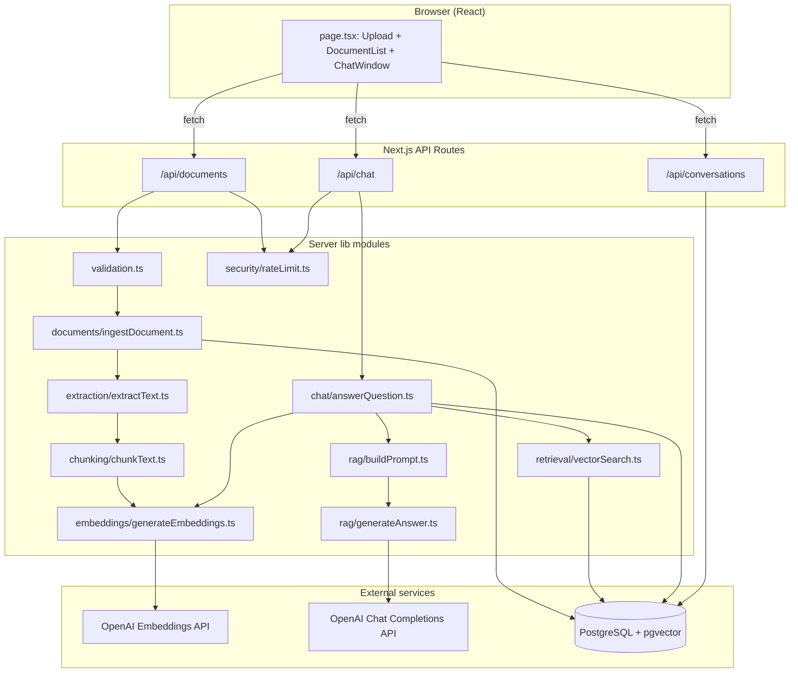

# Architecture

## Overall shape

This is a single Next.js App Router application (no separate backend
service). "Server" and "client" both live in the same codebase; Next.js
draws the line based on the `"use client"` directive and where a file
lives (`app/api/*` is always server-only).

```
Browser (React client components)
        │  fetch()
        ▼
Next.js API routes (src/app/api/**)      ← thin HTTP layer only
        │  calls
        ▼
Server-side lib modules (src/lib/**)     ← all real business logic
        │
        ├─ OpenAI API (embeddings + chat completions)
        └─ PostgreSQL + pgvector (via Prisma / raw SQL)
```

The spec's core architectural requirement — "do not put the entire RAG
pipeline in one API route" — shows up directly in the folder layout:
each responsibility (extraction, chunking, embeddings, retrieval,
prompting, generation, persistence) is its own module in `src/lib/`,
and the API routes only parse the HTTP request, call one orchestrating
function, and shape the HTTP response.

## Final folder structure

```
rag-chatbot/
├── prisma/
│   ├── schema.prisma              # Document, DocumentChunk, Conversation, Message
│   └── migrations/20250101000000_init/migration.sql
├── src/
│   ├── app/
│   │   ├── page.tsx                # the whole UI (client component)
│   │   ├── layout.tsx
│   │   ├── globals.css
│   │   └── api/
│   │       ├── documents/route.ts          # GET list, POST upload
│   │       ├── documents/[id]/route.ts     # DELETE
│   │       ├── chat/route.ts               # POST ask a question
│   │       └── conversations/route.ts,
│   │           conversations/[id]/route.ts # list / fetch history
│   ├── components/
│   │   ├── DocumentUpload.tsx
│   │   ├── DocumentList.tsx
│   │   ├── ChatWindow.tsx
│   │   ├── MessageBubble.tsx
│   │   └── SourceCard.tsx
│   ├── lib/
│   │   ├── config.ts                # all env vars, read in one place
│   │   ├── prisma.ts                # shared PrismaClient singleton
│   │   ├── openai.ts                # shared OpenAI client
│   │   ├── types.ts                 # shared TS interfaces
│   │   ├── validation.ts            # upload + request validation (zod)
│   │   ├── extraction/extractText.ts
│   │   ├── chunking/chunkText.ts
│   │   ├── embeddings/generateEmbeddings.ts, pgvector.ts
│   │   ├── retrieval/vectorSearch.ts
│   │   ├── rag/buildPrompt.ts, generateAnswer.ts
│   │   ├── documents/ingestDocument.ts   # orchestrates the ingestion pipeline
│   │   ├── chat/answerQuestion.ts        # orchestrates the QA pipeline
│   │   └── security/rateLimit.ts
│   └── __tests__/                   # vitest unit tests for the pure logic above
└── docs/                             # this directory
```

## Components and responsibilities

| Layer | File(s) | Responsibility |
|---|---|---|
| UI | `components/*`, `app/page.tsx` | Upload, document list, chat, source cards. No business logic — everything is a `fetch()` to an API route. |
| API routes | `app/api/**/route.ts` | Parse the request, call one `lib/` function, map errors to HTTP status codes. |
| Validation | `lib/validation.ts` | File type/size/emptiness checks; zod schema for chat requests. |
| Extraction | `lib/extraction/extractText.ts` | Turns a PDF/TXT buffer into `{ pageNumber, text }[]`. The only format-aware module. |
| Chunking | `lib/chunking/chunkText.ts` | Turns pages into overlapping, page-tagged text chunks. Pure function, no I/O. |
| Embeddings | `lib/embeddings/*` | Calls OpenAI's embeddings endpoint (batched); formats vectors for pgvector. |
| Storage | `prisma/schema.prisma`, `lib/documents/ingestDocument.ts` | Document/DocumentChunk/Conversation/Message tables; raw SQL insert for the vector column. |
| Retrieval | `lib/retrieval/vectorSearch.ts` | Cosine-similarity search over `DocumentChunk.embedding` via pgvector's `<=>` operator. |
| Prompting | `lib/rag/buildPrompt.ts` | Builds the system prompt and the numbered, delimited context block. |
| Generation | `lib/rag/generateAnswer.ts` | Calls the chat model; detects the `INSUFFICIENT_CONTEXT:` marker; attaches/omits sources. |
| Orchestration | `lib/documents/ingestDocument.ts`, `lib/chat/answerQuestion.ts` | The two "top-level" functions that wire the above into the two flows below. Nothing else calls OpenAI or Prisma directly except these and the modules they call. |
| Security | `lib/security/rateLimit.ts` | Per-IP in-memory rate limiting on `/api/documents` (POST) and `/api/chat`. |

## Data flow

**Ingestion** (triggered by `POST /api/documents`):
`validateUploadedFile` → `extractText` → `chunkDocument` → `generateEmbeddings` → raw-SQL insert into `DocumentChunk`.

**Question answering** (triggered by `POST /api/chat`):
`chatRequestSchema.parse` → `generateEmbedding(question)` → `findSimilarChunks` → `buildUserPrompt` → `generateAnswer` (OpenAI chat) → persist `Message` rows.

Both are implemented as single orchestrating functions
(`ingestDocument`, `answerQuestion`) that call the smaller modules in
order — see `docs/CODE_WALKTHROUGH.md` for a line-by-line trace, and
`docs/REQUEST_FLOWS.md` for sequence diagrams.

## Architecture diagram



See `docs/DECISIONS.md` for why certain choices (synchronous ingestion,
in-memory rate limiting, no LangChain) were made and what to change for
larger-scale production use.
