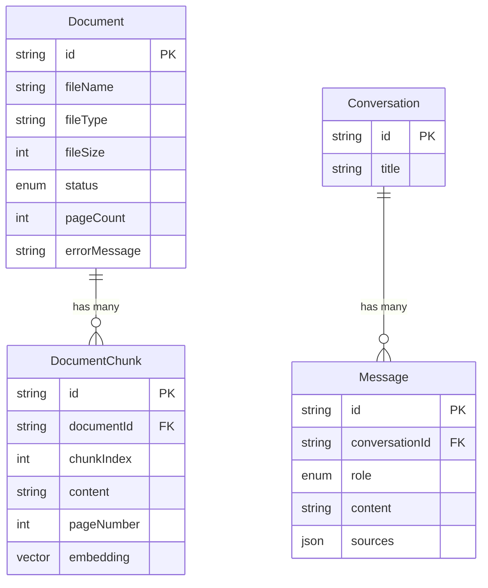

# Database

PostgreSQL with the [pgvector](https://github.com/pgvector/pgvector)
extension, managed with Prisma. Schema: `prisma/schema.prisma`.

## Tables

### Document

One row per uploaded file.

| Column | Type | Notes |
|---|---|---|
| `id` | `String` (cuid) | PK |
| `fileName` | `String` | Original filename, shown in the UI and in citations |
| `fileType` | `String` | `"pdf"` \| `"txt"` |
| `fileSize` | `Int` | Bytes, checked against `MAX_FILE_SIZE_MB` at upload |
| `status` | `DocumentStatus` enum | `PROCESSING` → `READY` or `FAILED` |
| `pageCount` | `Int?` | Known for PDFs, `null` for `.txt` |
| `errorMessage` | `String?` | Set when `status = FAILED` |
| `createdAt` / `updatedAt` | `DateTime` | |

### DocumentChunk

One row per chunk produced by `chunkDocument`.

| Column | Type | Notes |
|---|---|---|
| `id` | `String` (cuid / uuid) | PK |
| `documentId` | `String` | FK → `Document.id`, `onDelete: Cascade` |
| `chunkIndex` | `Int` | Global order within the document |
| `content` | `String` | The actual text sent to the LLM as context |
| `pageNumber` | `Int?` | `null` for `.txt` sources |
| `tokenCount` | `Int?` | Rough estimate (chars / 4), for prompt budgeting |
| `embedding` | `vector(1536)` | pgvector column — see below |
| `createdAt` | `DateTime` | |

### Conversation

| Column | Type | Notes |
|---|---|---|
| `id` | `String` (cuid) | PK |
| `title` | `String?` | First 80 characters of the first question |
| `createdAt` / `updatedAt` | `DateTime` | |

### Message

| Column | Type | Notes |
|---|---|---|
| `id` | `String` (cuid) | PK |
| `conversationId` | `String` | FK → `Conversation.id`, `onDelete: Cascade` |
| `role` | `MessageRole` enum | `USER` \| `ASSISTANT` |
| `content` | `String` | The message text |
| `sources` | `Json?` | Snapshot of `SourceReference[]` for `ASSISTANT` messages |
| `createdAt` | `DateTime` | |

## Relationships



`Document 1—N DocumentChunk` and `Conversation 1—N Message` are the
only two relationships in the schema — deliberately simple, matching
what the spec asked for (no join tables, no many-to-many).

## Why `Message.sources` is a JSON snapshot, not a foreign key

A `Message`'s sources reference specific chunks *at the time the
answer was generated*. If we stored that as a foreign key to
`DocumentChunk` and the user later deleted the document, either the
foreign key would need `onDelete: SetNull` (losing the citation
entirely) or deletion would be blocked (a document you can never
delete once it's been cited). Storing a JSON snapshot of
`{documentId, documentName, pageNumber, chunkIndex, snippet}` means
chat history stays fully readable and self-contained even after the
source document is deleted — the trade-off is that the snapshot can't
"follow" a document rename, which was judged acceptable since
documents aren't renameable in this app anyway.

## pgvector

### Why `Unsupported("vector(1536)")`

Prisma doesn't ship a native pgvector field type. `Unsupported(...)`
tells Prisma's migration engine "create this column with this exact
Postgres type," while marking it as a type Prisma Client can't read or
write through its normal typed API. In practice that means:

- Migrations (`prisma/migrations/`) create the column correctly.
- Every read or write of the `embedding` column goes through raw SQL —
  `prisma.$executeRaw` for inserts (`src/lib/documents/ingestDocument.ts`)
  and `prisma.$queryRaw` for the similarity search
  (`src/lib/retrieval/vectorSearch.ts`).
- Every other column on the same tables still goes through the normal,
  type-safe Prisma Client API.

### The `vector` extension and index

The initial migration runs `CREATE EXTENSION IF NOT EXISTS vector;`
before creating any table that uses the type (extension must exist
first), and creates:

```sql
CREATE INDEX "DocumentChunk_embedding_idx" ON "DocumentChunk"
  USING ivfflat ("embedding" vector_cosine_ops) WITH (lists = 100);
```

**IVFFlat** is an approximate-nearest-neighbor index — it trades a
small amount of recall for much faster search on large tables. `lists
= 100` is a reasonable starting point; pgvector's own guidance is
roughly `lists ≈ rows / 1000` for tables under ~1M rows, so this should
be tuned upward as the number of chunks grows. On a small
table (the common case for a learning/demo project) the index has
little effect either way — Postgres may still choose a sequential scan
for very small tables, which is not a bug, just the planner correctly
judging the index isn't worth using yet.

### Similarity search

```sql
SELECT ...
FROM "DocumentChunk" c
JOIN "Document" d ON d."id" = c."documentId"
WHERE d."status" = 'READY'
ORDER BY c."embedding" <=> $1::vector ASC
LIMIT $2
```

`<=>` is pgvector's cosine **distance** operator (0 = identical
direction, 2 = opposite). The application layer converts this to a
`similarity` value (`1 - distance / 2`, so 1.0 = identical, 0.0 =
opposite) purely so calling code and any future UI can reason in
"higher is better" terms.
