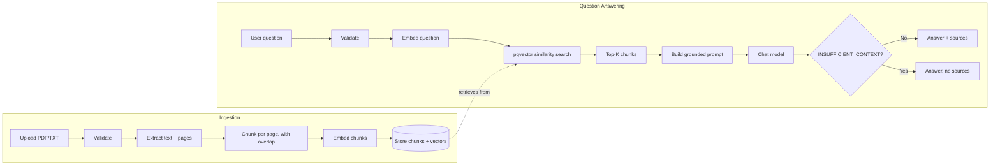

# RAG Pipeline

This document explains each stage of the pipeline as actually
implemented, in the order data moves through it.

## 1. Document ingestion (`src/lib/documents/ingestDocument.ts`)

Entry point for everything below. Creates a `Document` row with
`status: "PROCESSING"` immediately (so it shows up in the UI right
away), then runs the pipeline; on any error it sets
`status: "FAILED"` with `errorMessage` instead of leaving the row
stuck or deleting it — a failed upload stays visible with a reason.

## 2. Text extraction (`src/lib/extraction/extractText.ts`)

- **.txt**: read as UTF-8, treated as a single "page" with
  `pageNumber: null` (plain text has no page concept, so citations for
  .txt sources never show a page number).
- **.pdf**: uses `pdf-parse` (a thin wrapper over Mozilla's `pdf.js`).
  Its `pagerender` hook runs once per page during parsing; we use it to
  push each page's text into our own array instead of pdf-parse's
  default single concatenated string, which is how page numbers are
  preserved. A PDF with no extractable text (e.g. a scanned image with
  no OCR layer) throws a clear error rather than silently ingesting an
  empty document.

## 3. Chunking (`src/lib/chunking/chunkText.ts`)

A pure function, no I/O, so it's fully unit-tested
(`src/__tests__/chunking.test.ts`) without touching OpenAI or the
database.

- Operates **per page**, so a chunk never silently merges text from two
  different pages — `pageNumber` on a chunk is always unambiguous.
- Target chunk size and overlap are configurable
  (`RAG_CHUNK_SIZE` / `RAG_CHUNK_OVERLAP`, default 1000 / 150
  characters). Character-based rather than token-based counting was a
  deliberate simplicity choice — see `docs/DECISIONS.md`.
- Breaks on the nearest preceding space so words are never split in
  half.
- Overlap means the tail of chunk *N* reappears at the start of chunk
  *N+1*, so a sentence or idea that straddles a chunk boundary is still
  fully present in at least one chunk.
- `chunkIndex` increases monotonically across the *whole document*
  (not reset per page), so chunks can always be displayed/ordered in
  original reading order regardless of page.

## 4. Embedding generation (`src/lib/embeddings/generateEmbeddings.ts`)

Calls OpenAI's `/embeddings` endpoint with `text-embedding-3-small`
(1536 dimensions, matching `vector(1536)` in the Prisma schema).
Batches up to 96 chunks per request (OpenAI accepts a string array as
`input`) to avoid one HTTP round-trip per chunk on large documents.

## 5. Vector storage (`src/lib/documents/ingestDocument.ts`, `embeddings/pgvector.ts`)

Prisma's `Unsupported("vector(1536)")` type means the embedding column
exists in the schema and migration, but Prisma Client can't bind a
JS array to it directly. `toPgVectorLiteral()` formats a `number[]` as
pgvector's text literal (`"[0.1,0.2,...]"`), and the insert happens via
`prisma.$executeRaw` inside a `$transaction`, so a document's chunks
are either all stored or none are — a failure partway through doesn't
leave a document with some embedded chunks and some missing (the whole
document is instead marked `FAILED` and the transaction rolls back).
See `docs/DATABASE.md` for the full pgvector explanation.

## 6. Query embedding (`src/lib/chat/answerQuestion.ts` → `generateEmbedding`)

The user's question is embedded with the exact same model
(`generateEmbedding`, a one-string wrapper around the batch function
above), since cosine similarity is only meaningful when both vectors
come from the same embedding space.

## 7. Retrieval (`src/lib/retrieval/vectorSearch.ts`)

`findSimilarChunks` runs one SQL query using pgvector's `<=>` cosine
distance operator, joined against `Document` so only chunks belonging
to a `READY` document are ever returned — a document mid-ingestion or
that failed never contributes a partial/broken source. Configurable
top-K (`RAG_TOP_K`, default 5). Results are converted from "distance"
(0 = identical, lower is better) to "similarity" (0..1, higher is
better) purely so downstream code and any future UI work in the more
intuitive direction.

## 8. Context construction (`src/lib/rag/buildPrompt.ts`)

Retrieved chunks are formatted into a numbered block — `Source [1]`,
`Source [2]`, ... — each labeled with its source document name and
page number, wrapped in fixed delimiter markers
(`<<<RETRIEVED_CONTEXT_START>>>` / `...END>>>`). The numbering order
here is exactly the order `sources` are later returned in the API
response, so a "Source [2]" the model refers to in its answer
corresponds to the second source card the UI renders.

If retrieval returns zero chunks (e.g. no documents uploaded yet, or
nothing is similar enough), the context block explicitly says so
rather than being empty — this makes "no relevant information found"
an explicit signal to the model instead of an ambiguous blank.

## 9. Generation (`src/lib/rag/generateAnswer.ts`)

Calls the chat model (`gpt-4o-mini` by default) with a system prompt
(`SYSTEM_PROMPT` in `buildPrompt.ts`) instructing it to answer only
from the supplied context, and a low temperature (0.2) to favor
faithfulness over creative variation. See "Prompt injection defense"
below for the security-relevant part of this prompt.

The model is asked to prefix an answer with `INSUFFICIENT_CONTEXT:`
when the retrieved context doesn't actually answer the question.
`parseModelResponse` (the pure, directly-tested part of this module)
strips that marker before showing the user the sentence, but records
`isGrounded: false` — and only in that case are `sources` omitted from
the response, so the UI never shows source cards next to an "I don't
know" answer.

## 10. Citations

Because `sources` are only populated for grounded answers, and each
source carries `documentName`, `pageNumber`, `chunkIndex`, and a text
`snippet`, the UI can render a `SourceCard` per source directly from
the API response — no separate citation-matching step is needed; the
sources *are* the chunks that were actually sent to the model.

## Flow diagram

## Prompt injection defense

Uploaded documents are untrusted input by definition — a chunk's text
came from a file someone uploaded, not from the application. The
defense here is prompt-level, not a code-level filter (that's a
deliberate, documented trade-off — see `docs/DECISIONS.md`):

1. Retrieved context is wrapped in fixed delimiter markers, and the
   system prompt explicitly tells the model everything between them is
   *data*, not instructions — including text that looks like commands
   ("ignore previous instructions", "you are now...").
2. The system prompt is a separate message from the user/context
   content, which most chat models weight more heavily than in-context
   text — this is the same mechanism the model providers themselves
   rely on for system-prompt adherence.
3. Answers are grounded: the model is told to answer only from context
   and to flag insufficient context explicitly, which narrows what an
   injected instruction could even get the model to *do* (it can't ask
   the model to browse the web or run code — no such tools are wired
   up in this app).

**Limits**: this is a real but not airtight defense. A sufficiently
crafted document could still influence the wording of an answer that
quotes it. This app doesn't take any action based on model output
(no tool-calling, no code execution, no sending emails), so the
worst realistic outcome of a successful injection is a misleading
*answer*, not a compromised system — which is why this trade-off was
judged acceptable for the project's scope.
