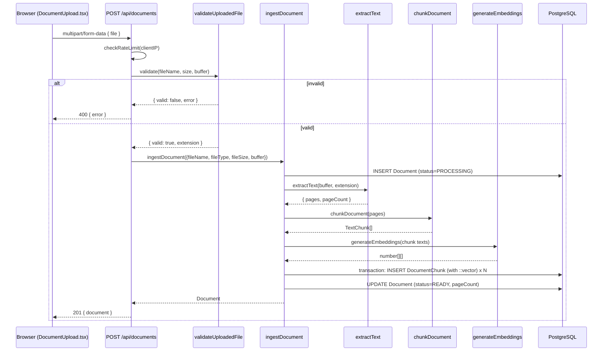
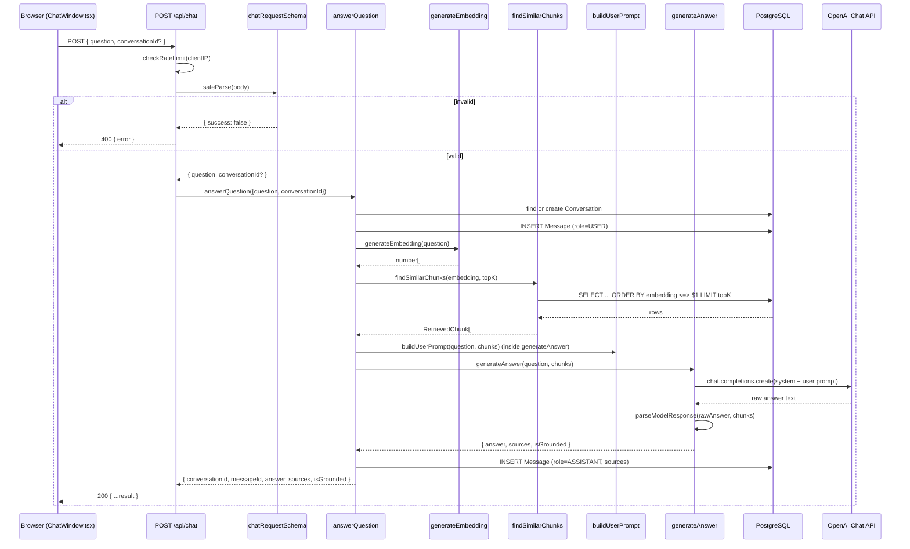
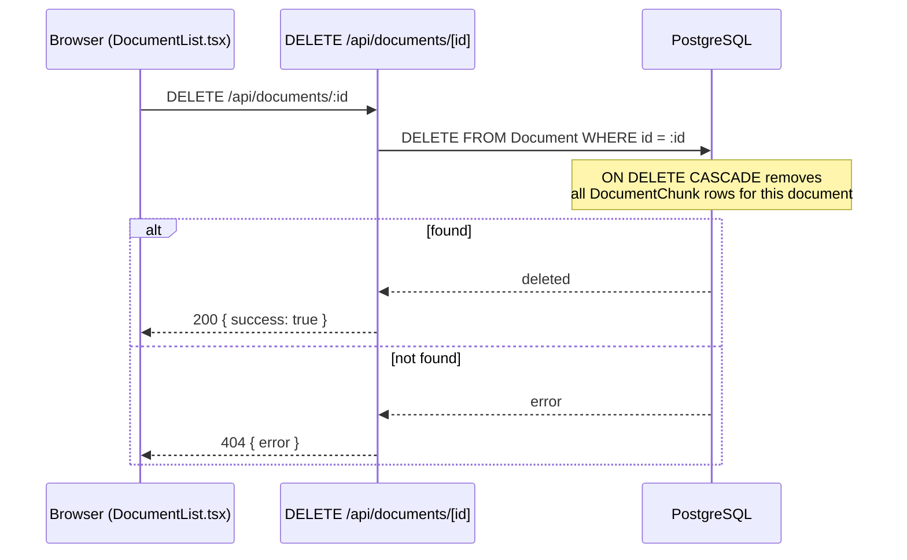

# Request Flows

Sequence diagrams for the two main flows, matching the actual function
calls (see `docs/CODE_WALKTHROUGH.md` for the file-by-file detail).

## Upload a document

On any error inside `ingestDocument` (extraction failure, embedding API
error, DB error), the `Document` row is updated to `status=FAILED` with
`errorMessage` before the error is re-thrown, and the route returns 500.

## Ask a question

## Delete a document

